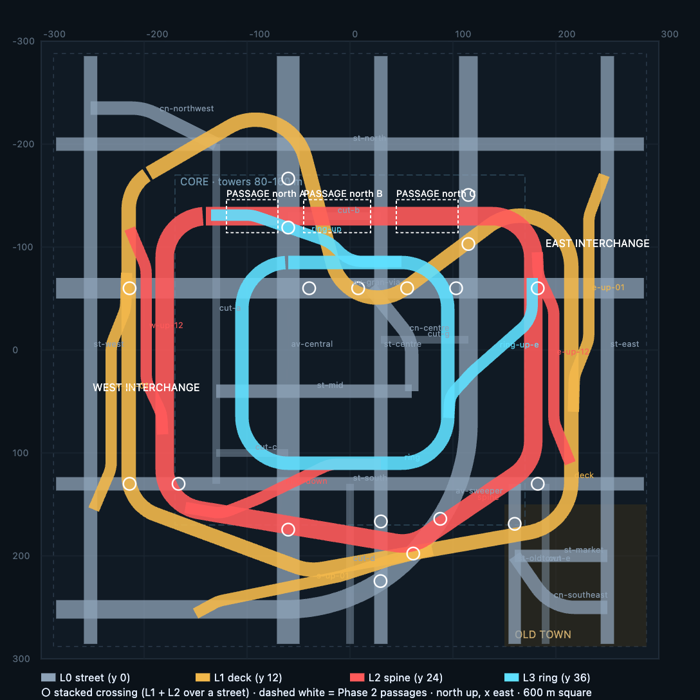

# City v2 — "The Stack": Phase 0 plan

Phase 0 of `docs/CITY_V2_BRIEF.md`, approved 2026-09-12, then amended by Phase 1 the same day:
the road network now lives in `src/world/stackSpec.ts` and `scripts/stack-preview.mjs` reads it
from there, so the checker and the game cannot drift. Phase 1 changed five ramps and measured
the budget for real; those changes are marked **[Phase 1]** below and gathered in §15. Everything
measured below comes from running the checker against the real `src/world/track.ts`.

    node scripts/stack-preview.mjs        # checks + docs/city-v2-plan-ribbons.svg/.png



Grey = L0 streets, amber = L1 deck (y 12), red = L2 spine (y 24), cyan = L3 ring (y 36).
White circles = stacked crossings. Dashed white = the first three Phase 2 passages. North up,
x east, z south, as in `citySpec.ts`.

## 1. The idea in one paragraph

Bandido Bay is a grid with a highway round the edge. The Stack is a 600 x 600 m block of city
with the highway through the middle of it: a closed L2 loop (the SPINE) 24 m up, cutting
mid-block through the core so towers stand at its rails and over it; a second closed loop
12 m up (the DECK) that wanders the whole map and pinches through the centre in a hairpin,
crossing under the spine four times; a small closed loop 36 m up over the core (the RING);
and a street network underneath that is two avenues, one long sweeper, three cross streets,
curved connectors and seven narrow cuts. The three elevated loops are joined by eight ramps in
two vertical CORRIDORS on the west and east edges of the core, where street, deck and spine
run parallel 35 m apart and the ramps climb in the gaps between them — that is the
"three levels at once" picture of `city-v2-street.webp`, and the corridors are also where
the L2 passages of `city-v2-highway.webp` begin.

## 2. Section through a corridor (looking north, west interchange)

```
 y 36                                   . . . . . . . . . . . . ring (L3) further east
 y 24                                              ┌───── spine ─────┐   x -180  hw 9
 y 12               ┌───── deck ─────┐             │                 │   x -215  hw 7
                    │                │  w-up-12    │                 │
 y  0   st-west  ═══╪════════════════╪═════════════╪═════════════════╪═══  av-gran-via (crossing)
        x -252      │   w-up-01      │             │                 │
                  gap -232          gap -198
        |<-- 20 -->|<---- 17 ------>|<--- 17 ---->|<---- 18 ----->|
```

Every ramp starts inside one road, runs beside the next in the gap, and slides in parallel,
the way `RAMP_SPECS` do in Bandido Bay. The gaps are sized so a ramp's own slab (5.5 m half
width) never touches a deck or a street edge while it is at a different height.

## 3. The four levels

| Level | Road | y | Width | Length | Shape |
|---|---|---|---|---|---|
| L0 | 21 streets | 0 | 7.5–22 m | 6,533 m | see §4 |
| L1 | `deck` | 12 | 14 m | 1,591 m | closed; corners w(-215,-160) nw(-60,-250) pinch(0,-20) ne(215,-180) se(215,170) s(-40,215) sw(-215,150) |
| L2 | `spine` | 24 | 18 m | 1,213 m | closed; corners nw(-180,-130) ne(178,-130) se(178,110) s(60,190) w(-180,150); fillets 40 m |
| L3 | `ring` | 36 | 13 m | 713 m | closed; (-105,-85) (95,-85) (95,110) (-105,110); fillets 45 m |
| ramps | 8 | 0→12, 12→24, 24→36 | 11 m | 1,699 m **[Phase 1]** | table in §5 |

Elevated road in total: 5,216 m (Bandido Bay: 3,376 m). That number drives the triangle
budget in §9 and is the plan's biggest risk.

## 4. L0 — the streets

Not a grid. Spacing between parallel roads runs 70–140 m; the corridors and the diagonal
decks cut the blocks between them into uneven plots.

| Tag | Width | Runs | Role |
|---|---|---|---|
| `av-central` | 22 | x -60, edge to edge | the spine avenue; skybridges over it inside the ring |
| `av-gran-via` | 20 | z -60, edge to edge | crosses both corridors: the stacked-crossing avenue |
| `av-sweeper` | 18 | z 252 from the west edge, one 170 m arc, then north up x 115 | the long sweeper; its arc runs under the deck's south leg |
| `st-west` / `st-east` | 13 | x -252 / x 250, edge to edge | the corridors' ground level; the L0↔L1 ramps start here |
| `st-centre` | 13 | x 30, edge to edge | passes under the ring twice and the spine twice |
| `st-north` / `st-south` | 13 | z -200 / z 130, edge to edge | cross streets |
| `st-mid` | 13 | z 40, x -130..60 | ends in `cut-a` and `cn-centre`; does not enter the west corridor |
| `st-oldtown`, `st-market` | 12 | x 160 z>130; z 200 x 160..250 | the old-town pocket's streets |
| `cn-northwest`, `cn-centre`, `cn-southeast` | 13 | curved | connectors with 40–50 m fillets |
| `cut-a` … `cut-g` | 7.5 | 7 alleys, 80–330 m | one-way cuts; `cut-a` is a 330 m slot down x -130 |

Districts (`zoneOf`): CORE = corporate, |x| < 175 and -150 < z < 200 (towers 80–160 m,
the spine and ring inside it); OLD TOWN = jdm, x > 150 and z > 130 (the pocket: 3–6 storey
shabby blocks, alleys, the reclamation and graffiti live here); everything else urban.
Perimeter: a 12 m wall band packed with towers on all four sides, as Bandido Bay's three land
sides — no water. The map never shows bare ground at its edge.

## 5. Ramps and interchanges

| Ramp | From → to | Merge heading | Length | Peak grade | Where it lives |
|---|---|---|---|---|---|
| `w-up-01` | st-west (0) → deck (12) | north | 201 m | 12.0 % | west gap x -232, z 120 → -75 **[Phase 1: foot moved north of st-south]** |
| `w-up-12` | deck (12) → spine (24) | **north** | 210 m | 9.1 % | west gap x -198, z 115 → -88 **[Phase 1: turned round, see §15]** |
| `e-up-01` | st-east (0) → deck (12) | south | 235 m | 12.8 % | east gap x 232, z -170 → 60 **[Phase 1: flat until clear of st-east]** |
| `e-up-12` | deck (12) → spine (24) | north | 211 m | 10.2 % | east gap x 198, z 110 → -95 |
| `ring-up` | spine north leg (24) → ring north leg (36) | east | 193 m | 12.6 % | (-135,-131) → (-88,-114) at 24, then up to (50,-86) **[Phase 1: leaves the spine sideways before climbing]** |
| `ring-up-e` | spine east leg (24) → ring east leg (36) | south | 169 m | 14.2 % | diagonal, (177,-70) → (96,66) |
| `ring-down` | ring south leg (36) → spine south leg (24) | west | 200 m | 13.5 % | diagonal, (30,111) → (-160,153) |
| `s-up-01` | av-sweeper (0) → deck south leg (12) | east | 280 m | 11.8 % | (-190,255), flat to (-150,236.5), up to (-20,228), merge at (80,194) **[Phase 1: foot and approach moved]** |

All eight are drivable both ways (an "up" ramp is the "down" ramp for the other direction of
travel, as on the viaduct today); the heading named is the one whose merge is tangential.

**The directions are a system [Phase 1].** The checker is undirected and could not see it, but
in the approved draft both deck→spine ramps left the deck in the same direction, so a car that
came up either corridor on-ramp (which merge clockwise) could never reach the spine without a
U-turn, and the spine's ring-facing direction could never come down. With `w-up-12` turned
round, every direction of every loop has a way up and a way down, as both directions of the
Bay's viaduct do: deck clockwise climbs by `w-up-12` and comes down by `s-up-01` reversed; deck
anticlockwise climbs by `e-up-12` and comes down by either corridor on-ramp reversed; spine
clockwise climbs to the ring by `ring-up` / `ring-up-e` and comes down by `e-up-12` reversed;
spine anticlockwise climbs by `ring-down` reversed and comes down by `w-up-12` reversed.
`tests/stackWorld.test.ts` holds this as a rule.
WEST INTERCHANGE: the corridor x -252..-180 between z -120 and 155, `w-up-01` and `w-up-12`.
EAST INTERCHANGE: x 178..250 between z -170 and 110, `e-up-01` and `e-up-12`. The ring's
three ramps and the south ramp are the extra connections that keep the loops from being
reachable at the corridors only.

Checker results (same rules as `tests/cityWorld.test.ts`): every grade under 17 %; every
elevated sample over a street is at least 5.5 m up (first/last 40 m of a ramp excepted, the
merge); every deck-over-deck point either clears 5.5 m or is a merge within 80 m of a ramp
end; every ramp end lies inside another road at that road's height; every street ends in a
road or at the perimeter. No problems reported.

Reachability, measured on the sample graph:

| From | to nearest ramp junction: worst / mean | to L0 | to L1 | to L2 | to L3 |
|---|---|---|---|---|---|
| L0 (streets) | 490 / 257 m (worst at the old town's south end) | – | 638 | 913 | 1060 |
| L1 deck | 384 / 156 m (worst at the pinch) | 578 | – | 577 | 744 |
| L2 spine | 240 / 77 m | 685 | 462 | – | 324 |
| L3 ring | 169 / 63 m | 811 | 579 | 248 | – |

The brief asks for "every level reachable from every other within 400 m of road". With a 12 m
rise at ≤ 17 % peak grade a ramp cannot be shorter than about 170 m, so the "arrive on the
other level" figure (right-hand columns, ramp included) cannot be under ~400 m for a
600 m map with two interchanges. What the plan meets is the left column: from anywhere on
the spine or ring a level change starts within 240 m, from the deck within 384 m. The
street figure is dominated by the old-town pocket and the far corners. **Open question for
Juan (§11): accept the left-column reading, or add two more L0↔L1 ramps (north side of the
deck, old town) at ~+10k triangles.**

## 6. Stacked crossings and enclosed stretches

Stacked crossings (an L0 street sample with an L1-height road within 30 m and an L2+ road
within 30 m overhead), 19 found, well over the six required. The ones worth framing:

- `av-gran-via` in both corridors: street, ramp, deck, ramp, spine within 70 m (x -214 and x 182).
- `av-gran-via` under the deck's pinch at x -40 / 8 / 56 with the ring's north leg 25 m north.
- `av-sweeper` at (115,-103..-151): sweeper under the deck's ne leg under the spine's north leg.
- `st-centre` at (30,167): deck's s→sw leg under the spine's s corner.
- `st-south` at (-214,130) and (182,130): corridor decks and the spine corners.
- `av-central` at (-60,-119): under the spine's north leg with the ring's west leg beside it.

Enclosed stretches (Phase 2): the brief wants ≥ 40 % of the spine (485 m) enclosed on two
sides and ≥ 30 % of L1+L2 (840 m of 2,804) inside or under buildings. Planned:

| Stretch | Where | Length | Form |
|---|---|---|---|
| north A | spine z -130, x -120..-70 | 50 m | megastructure passage, ceiling at 33 m |
| north B | spine z -130, x -45..20 | 65 m | passage; bridges av-central at ground |
| north C | spine z -130, x 45..105 | 60 m | passage; bridges st-centre |
| east | spine x 178, z -100..-40 and 0..60 | 120 m | passage, both corridors' towers over it |
| south diagonal | spine (60,190)→(-180,150), two runs | 130 m | passage through the core's south towers |
| west | spine x -180, z -90..-20, 30..100 | 140 m | passage; walls both sides, deck 35 m west |
| **spine total** | | **565 m = 47 %** | |
| deck: nw leg, ne leg, s→sw leg | three runs | 300 m | portal frames + skybridge boxes over the deck |
| **L1+L2 inside/under** | | **865 m = 31 %** | |

Portal frames (the highway image's overhead frames every ~30 m with amber strip lights) go on
every open stretch of the spine and the ring, so the L2 shot always has structure within 40 m
overhead.

## 7. Massing and districts (Phase 2 targets, recorded now)

- Core towers 80–160 m on the plots between the spine and the ring, kit archetypes
  `podium`, `stepped`, `cantilever`, `twin`; every facade concrete-banded on the lower three
  storeys (`wallDetail`), `panels`/`louvre`/`stack` styles over glass.
- Zero setback: `CITY_BLOCK_OPTIONS.shoulder` = { corporate 0.8, urban 0.8, jdm 0 } and the
  kerb field paves only at bus stops and stalls. `blockSetback` in `cityBuilder.ts` becomes a
  spec value.
- Skybridges over `av-central` (five, y 18/26/40), `av-gran-via` (four), `st-centre` (three),
  `st-north` (two): 14 lit, 8 bare concrete. `findSkybridges` gets a per-spec list instead of
  its Bay tag list.
- Landmarks: three hand-drawn silhouettes on the horizon at (-240,-240) `spire`, (250,-250)
  `blade`, (-250,250) `twins` (kit `LANDMARKS`), 1.45x height.
- Old town: x 150..288, z 130..288, massing 1, `jdmShabby` 0.8, alleys `cut-e`, the market
  street, graffiti pockets seeded here (`RECLAIM.pocketChance` biased by zone as today).
- Perimeter band and far skyline as `buildPerimeter` / `buildSkyline` with the core's heights.

## 8. Builder extensions needed (and what they cost)

| Extension | Where | Phase | Estimated cost |
|---|---|---|---|
| `createCityWorld(spec)`: factor the Bay constants out of `cityWorld.ts` into a `CitySpec` object (bounds, wall band, roads, elevated roads with their `y`, block options, zones, traffic loops and deck cars, bus routes, spawn, dressing lists, water or none) | `src/world/cityWorld.ts`, new `src/world/stackSpec.ts` | 1 | 0 triangles; `citySpec.ts` becomes the Bay's `CitySpec`, behaviour for `'city'` unchanged, existing tests pin it |
| Multi-level rails: `buildRails` already gaps a rail where another ribbon is at the same level; the corridor ramps need the gap test to accept a ramp that is *beside* a deck at merge height (the last 40 m) — today's `onRibbonAtLevel` pad of 1.6 m covers it | `src/world/cityGen.ts` | 1 | 0 |
| Pillars in the corridors: a pillar of the spine must not land on the deck or a ramp; the existing lower-deck test handles it. Ramps get their own pillars where they are over 4.5 m | `cityWorld.ts` pillars | 1 | ~3k (≈150 extra pillar pairs at 20 tris) |
| Traffic on every level: `TRAFFIC_LOOPS` for streets; the deck, spine and ring each get `VIADUCT_CARS`-style lane files (two lanes each way) | `stackSpec.ts`, `cityWorld.ts` | 1 | 0 static; see §10 for the draw-call risk |
| Covered-passage module: a `PassageDef` (a megastructure volume whose underside is a passage ceiling) drawn by `elevatedBuilder` as ribs + ducts + amber strip lamps + light pools; `MegastructureDef` gets `passages: PassageDef[]` | `cityPlan.ts`, `cityMegastructures.ts`, `megastructureBuilder.ts`, `elevatedBuilder.ts` | 2 | ~40 tris/m → 23k for 565 m (flagged: > 25k rule if it grows; stays under) |
| Portal frames: a frame every 30 m over the open spine/ring: two piers + a beam + a lamp box, 60 tris each | `elevatedBuilder.ts` | 2 | 1,250 m of open elevated / 30 × 60 = 2.5k |
| Zero-setback street walls: `blockSetback` and `CITY_BLOCK_OPTIONS.shoulder` from the spec; ground floors (`groundFloor.ts`) on every street-facing wall, no blank run > 20 m | `cityBuilder.ts`, `groundFloor.ts` | 2–3 | 0 (moves geometry, adds none) |
| Warm window mix: `bay.windowsCorp/Urban/Jdm` re-weighted amber-first, cold white second, teal third; the spec picks the palette name and the kit reads the lists | `palette.ts` | 3 | 0 |
| Fog: `HAZE.cityDensity` per spec so a tower at 250 m is 70–80 % fog | `haze.ts`, spec | 3 | 0 |
| Light pools under passage and deck lamps: `groundGlow` already exists; the passage module calls it | `builders.ts` | 3 | 2 tris per pool |
| QA: `city-shots.mjs` takes a `--mode` and a vantage list per mode; `city-drive.mjs` a route list per mode; `megacity-check.mjs` generalised to "drive L0 → L1 → L2 → L3 → L0" | `scripts/` | 1 | – |

Nothing here adds a draw call: every extension writes into the existing per-material builders.
No new textures.

## 9. Triangle budget

Measured on Bandido Bay today (`builderStats`, 19 draw calls, 268.8k triangles):

| System | Bay triangles | Derived rate |
|---|---|---|
| track (asphalt, paint, shoulders, rails, viaduct undersides, pillars, lamps) | 134.8k | elevated structure ≈ 27 tris/m over 3,376 m; ground roads ≈ 7 tris/m; a street lamp is 112 |
| city (blocks, megastructures, roofs, crowns) | 76.5k | 72 blocks + 6 megastructures on 297k m² |
| reclamation (greenery, ground floors, decals) | 43.8k | 34k of it foliage |
| landmarks, props, transit | 13.8k | |

Naive extrapolation for The Stack (5,208 m elevated at Bay density, 6,533 m of street, 21 %
more land): ≈ 140k + 45k + 92k + 44k + 14k = **335k**. That does not fit, so the plan sets
the budget below and names the lever for each line:

| System | Budget | How |
|---|---|---|
| Elevated structure (skirts, soffits, ribs, girders, pillars, rails) | 62k | spine + deck at a 16 tris/m profile (ribs every 16 m instead of 10.5, one girder pair, tray as a decal); ring + ramps at 8 tris/m (skirt, soffit, ribs at 21 m, no services) |
| Ground roads, paint, shoulders | 18k | as Bay per metre, pavement only at stops and stalls |
| Street and deck lamps | 12k | ~110 lamps (Bay: 194); passage lamps are boxes, not the 112-triangle fixture |
| Buildings (blocks, perimeter, skyline) | 65k | bigger plots, fewer buildings; rooftop clutter off (brief rule 6); `KIT.mechChance` 0.3 |
| Megastructures, passages, portal frames | 28k | 565 m of passage at 40 tris/m + frames + three landmarks |
| Skybridges | 4k | 22 at ~180 |
| Ground floors, reclamation, graffiti | 15k | `RECLAIM.baseNeglect` 0.25, pockets in the old town and under the decks only |
| Props, transit, gates | 6k | |
| **Total** | **210k** | ceiling 220k; 19 draw calls (no new material) |

The elevated line is the one to verify first: Phase 1 builds the roads before any massing
exists, so its gate report will show the real per-metre cost of the network on its own. If it
comes in above 62k the fallbacks, in order, are: the ring's fillets and the two ring ramps
become one open skyway (-7k); the deck's ne leg is shortened (-8k); `RIB_SPACING` 16 → 21
everywhere (-6k).

## 10. Traffic

Bay density is one car per 27 m of viaduct (64 on 1,728 m). Scaled: deck 59, spine 45, ring
26, street loops ~50 (ten rectangles) → ~180 cars, against 126 today. The cars are not
instanced (each one is three or four draw calls, `scripts/perf-drawcalls.mjs` measured 248
calls looking down a boulevard), so 180 cars can cost 60 % more draw calls than the city
does now. Phase 1 will ship the scaled count and measure; if the `?debug=1` overlay drops
under 55 FPS at the six vantage points, the fallback is Bay's total (130) redistributed by
level length (L0 48, L1 34, L2 34, L3 14), and instancing the fleet becomes the next task
outside this brief.

## 11. Frame-test vantage points (to record in `city-shots.mjs` for Phase 2)

Heading 0 = north (-z), π/2 = east (+x), π = south.

| # | Name | Position, y, heading | What it must show |
|---|---|---|---|
| 1 | `spine-passage-north` | (-30, 24, -131), east | inside passage north B: walls both sides, ceiling, lamps, cars ahead, city through the gaps |
| 2 | `spine-passage-south` | (-20, 24, 176), heading 256° (WSW) | the south diagonal passage, the deck crossing under ahead |
| 3 | `gran-via-west` | (-240, 0, -60), east | the street image: ramp, deck, ramp, spine stacked ahead |
| 4 | `st-centre-south` | (30, 0, 150), south | deck and spine corner overhead, the sweeper's arc |
| 5 | `ramp-w-up-12` | (-198, ~23, -20), north **[Phase 1]** | mid-climb between deck and spine, towers both sides |
| 6 | `av-central-ring` | (-60, 0, -10), north | avenue with skybridges at three heights, the ring above |

Acceptance at each: sky < 15 % of the frame at 1, 2, 3, 4; structure within 40 m overhead at
1, 2, 3, 4 (and 6); far end fogged in all six; ≤ 20 static draw calls, ≤ 220k static triangles,
≥ 55 FPS at 1440x900 DPR 1.

## 12. Phase 1 wiring (for the record; not started)

- `GameMode` gains `'stack'` (`src/core/types.ts`), `modeFromUrl` accepts it, `game.ts` builds
  `createCityWorld(STACK_SPEC)` for it with police off and no intro, `mainMenu.ts` gets a card
  "THE STACK" after OPEN WORLD. Solo, not a server room: the open world's `WRLD` room stays
  the Bay until Phase 4. **Question for Juan: label "THE STACK"?**
- Tests: `tests/stackWorld.test.ts` mirrors `cityWorld.test.ts` (clearance, grades, pillars,
  the drive up every ramp under its own power, the budget) against the new spec; the Bay
  suite runs unchanged.
- Gate: `scripts/city-drive.mjs --mode stack` drives st-west → w-up-01 → deck (clockwise, a
  full lap) → w-up-12 → spine → ring-up → ring → ring-down → spine → e-up-12 (reverse) → deck
  → s-up-01 (reverse) → the sweeper without a collision, plus a screenshot from every level.
  **[Phase 1: the draft's route ended "e-up-12 (reverse) → deck → e-up-01 (reverse)", which
  needs a U-turn on the deck; see §5.]**

## 13. Known compromises in this draft

- The deck's s→se leg runs 15–35 m from the sweeper's arc for ~120 m and crosses it at
  (90,180); its pillars are skipped over the street there, so that stretch of deck spans
  ~60 m between columns. Phase 1 may nudge the deck's `s` corner north 10 m.
- `st-mid` and `cut-c` end in `cut-a` rather than crossing the west corridor: a cross street
  there would sit under `w-up-01` at 4 m of clearance.
- The ring's three ramps peak at 13.5–14.5 %: legal, but the steepest roads in either city.
- The two corridors are the only places L0 meets L1 besides `s-up-01`; see §5.

## 14. Questions for Juan at this gate

1. Reachability: accept "a level change starts within 240 m on L2/L3, 384 m on L1", or add
   two more L0↔L1 ramps (+10k triangles, north side and old town)?
2. Triangle ceiling: the plan lands at 210k only with the lean deck profile in §9. If you
   would rather keep Bay's underside detail on the spine, the network must shrink (drop the
   ring or the deck's ne leg). Which?
3. Traffic: ship 180 cars and measure, or start at 130?
4. Menu label: "THE STACK"?
5. No water: a wall of towers on all four sides. OK, or keep one water edge?

## 15. Phase 1 amendments (2026-09-12)

What Phase 1 changed in this plan, and why. The picture above is regenerated from the spec.

**Ramps.** Five of the eight moved (§5). `w-up-12` turned round so the loops' directions form a
system. Three feet re-laid because a ramp that climbs while its slab is still over a street's
lane, or still between the rails of the deck it is leaving, is a wall in that lane: `s-up-01`
(its right rail stood in the sweeper's north lane at 1-4 m for 50 m), `e-up-01` (its slab edge
over st-east at 0.7 m), `ring-up` (3 m up while still inside the spine's rails: the spine's rail
crossed its lane). `w-up-01`'s foot moved north of st-south, which it crossed as a 1 m hump. The
checker only walks centrelines; `tests/stackWorld.test.ts` walks both slab edges too.

**Sampling.** The elevated roads are sampled at 5 m round their bends instead of 3 m
(`arcStep`): a 5 m chord sits 7-10 cm off a 40 m arc, and a third of the network's slab and
rail segments were in its bends. Streets keep 3 m.

**Budget, measured.** With the Bay's builders unchanged the roads alone came to 322k triangles
(track 208k: decks 105k, columns and fences 41k, rails 33k, streets and lamps 34k; plain blocks
57k; reclamation 54k). The lean profile of §9, made real as optional `CityPlan` knobs the Bay
never sets (`ribSpacing` 16, `deckServices: 'lean'` = edge girders and one conduit only,
`lampSpacing` 56 m on streets / 76 m on decks, `neglect` 0.25) plus columns every 16 m with a
fence in one bay in three and the 5 m arcs, lands the roads-and-plain-blocks city at
**217k triangles in 17 draw calls**: track 131k (decks 58k, rails 26k, columns and fences 22k,
streets and lamps 26k), blocks 52k, reclamation 31k, props and landmarks 2k. The elevated
structure costs **20 triangles per metre** all in, against the 16 the plan budgeted and the
34 the Bay pays. Phase 2's passages, portal frames and skybridges (§9: 32k) do not fit under
220k on top of this without one of the fallbacks: the ring's two ramps and fillets as one open
skyway (−7k), ribs at 21 m (−3k), columns at 20 m (−4k), reclamation pockets in the old town
and under the decks only (−10k), or fewer street lamps. Juan's call at the Phase 2 gate.

**Traffic.** 184 cars shipped (streets 56, deck 60, spine 44, ring 24). At the six vantage
points the frame is 53-449 draw calls with the fleet, 235k-312k triangles; the worst is
`gran-via-west`, looking down the corridor at both decks' traffic. GPU time 2-3.5 ms at 1440x900
DPR 1. Not yet a problem on this machine; the fallback (130 cars by level length) stands.

## 16. Phase 2 amendments (2026-09-12)

What Phase 2 built, and where it departed from §6-§8. The road network is untouched.

**The buildings are carved, not placed.** `src/world/stackMassing.ts` lays twelve footprints by
hand over the spine, the ring, the deck and the two corridors, gives each a plain massing (a
podium and a shaft, a slab, or one block for the bridges) and hands it to the same carve the
Bay's district uses (`cityMegastructures.ts`, generalised): every ribbon reserves its asphalt,
2.4 m beside it and 8.5 m over it, from 2 m under the surface up. What survives is the
building — walls at the kerb, a ceiling over the lane, a slab across an interchange with the
decks and ramps passing through it at their own heights — and the same boxes are the
colliders, so no road can be sealed by a building. Two additions to the carve, both off for
the Bay: a straight road on the diagonal is cut as ONE box across the footprint instead of a
box per 8 m sample (a per-sample cut leaves a sawtooth wall beside the lane), and pieces
thinner than a metre in plan are dropped (the blades left between two reservations 17 m
apart; 140 of them, 7k triangles, nothing anyone would see as a wall).

**Passages are derived, not drawn.** A `PassageDef` is a run of a ribbon with a carved volume
over its centreline within 12 m of the road (`findPassages`): its clearance, and whether a
wall stands within 14 m of the asphalt edge on each side. `env/passageBuilder.ts` dresses them
(pale soffit strip, ribs every 9 m, two service runs, an amber strip lamp every 12 m with its
patch on the ceiling and its pool on the road, amber wall bars every 14 m on a walled side,
one red bar per passage) and puts portal frames every 30 m over the spine and the ring where
they are outside a passage, a merge or a crossing. 32 passages: spine 540 m (44.5 %, all of
it with a wall), deck, ramps and streets the rest; L1 + L2 inside or under a building 30.8 %.

**The corridors.** §6 planned "portal frames and skybridge boxes over the deck" for the deck's
share. In the corridors the roads run 17-18 m apart and each reserves 11-13 m, so nothing
solid survives between them at road height: a building across a corridor is a slab over the
whole interchange on a tower each side. Three sites do this (`east-n`, `east-s`, `west-s`),
which is where the deck's coverage comes from and is the highway-inside-a-structure of the
reference; the deck's diagonals get two more bridge buildings (`deck-nw`, `deck-s`). The
plan's "north A/B/C, east, south, west" spine passages are all built; the south one is 62 m
through a straight-walled building the diagonal drifts across.

**Skybridges.** `findSkybridges` takes the spec's tiers (16 / 27 / 40 m), a concrete share
(two in five), a step (45 m) and a cap (28), lands in the megastructures' ground masses as
well as the blocks, tries 14 m either way when a station falls on a crossing, and allows a
bridge under the ring when the ring is 14 m or more above it. Twelve placed over six streets.

**Zero setback.** Block shoulders 0.6 m (0.4 in the old town, 0.3 in the cuts), the blocks
keep 0.5 m of slab in front of their walls (`CityPlan.setback`), nothing is paved beside the
streets. Rooftop clutter at 0.35 of the Bay's (`roofClutter`), three landmark anchors at the
far corners (`landmarkAnchors`), the megastructures in the kit's facades only (`megaDetail:
'lean'`).

**Budget.** 241,432 static triangles in 17 draw calls: megastructures 23k, passages 11.6k,
frames 1.5k, skybridges under 1k, against the 217k Phase 1 left; zero setback took 11k off
the reclamation (no ledges to plant). Juan raised the 220k ceiling during this run rather
than have the enclosure thinned to fit; `tests/stackWorld.test.ts` now holds 250k. The
fallbacks of §15 (ribs at 21 m, columns at 20 m, fewer lamps) stay unused. GPU time at the
fourteen views 1.7-2.4 ms at 1440x900 DPR 1; 60 fps in the capture harness, 120 fps in the
desktop app's own window at DPR 1.5.

**Vantages (§11).** Two moved: `spine-passage-south` to (-47, 24, 169) so the car stands inside
the south passage rather than at its mouth, `st-centre-south` to (32, 0, 183), under the
spine's south corner with the deck's bridge building ahead; `gran-via-west` to x -234. Frame
test: sky 0.0 / 0.9 / 0.0 / 0.0 % at 1-4 (8.0 at the ramp, 1.1 on the avenue); structure
within 40 m overhead at 1, 2, 4, 5 (a ceiling 9 m over the two passages and the ramp, the
spine 24 m over st-centre); the far end fogged in all six; no map edge in any.

**Scripts.** `stackSpec.ts` now has one value import (`./stackMassing.ts`, which imports
`./cityMegastructures.ts`), spelt with the extension so `stack-preview.mjs` and
`city-shots.mjs` still load the spec under plain Node; `tsconfig.json` allows `.ts`
extensions (`allowImportingTsExtensions`, with `noEmit`). `city-shots.mjs --mode stack`
measures the frame test in the page: the sky share by a mask render with the atmosphere
hidden, and what stands overhead from the plan's own geometry.
